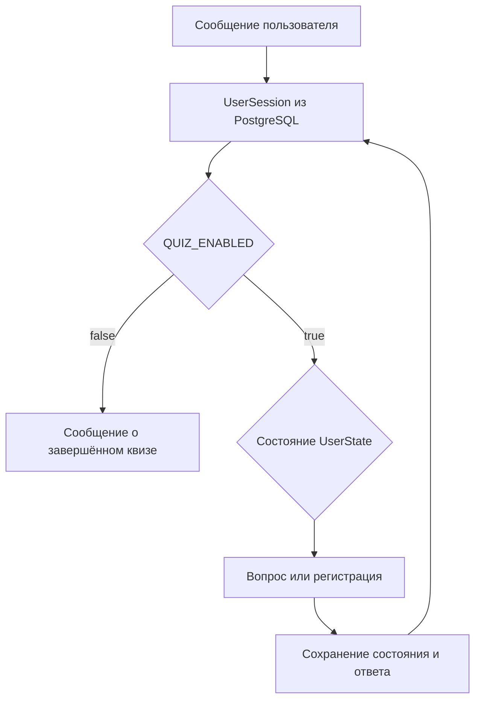

# qrver-vk-quiz-robot

VK-бот для проведения викторины и регистрации участников. Проект показывает обработку состояний диалога, клавиатур VK, загрузку изображений в сообщения и сохранение прогресса в PostgreSQL через Prisma.

## Возможности

- включение и выключение сценария через `QUIZ_ENABLED`;
- активация пользователя секретом из переменной окружения;
- пять вопросов с вариантами ответа и повтором при ошибке;
- регистрация ФИО, города, компании и места работы;
- редактирование данных перед подтверждением;
- сохранение сессий, ответов и регистраций в PostgreSQL;
- автоматическая синхронизация изображений из `media/public` с VK;
- корректное завершение VK long polling и подключения к БД.

## Скриншоты


## Стек и архитектура

TypeScript, Node.js 22, `vk-io`, PostgreSQL 16, Prisma 6, Docker Compose.

Архитектура - модульный монолит. Точка входа находится в `index.ts`, маршрутизация в `src/modules/routes.ts`, логика викторины и регистрации - в модулях `src/modules`, интеграции - в `src/service`, схема БД и миграции - в `prisma`.

## Переменные окружения

Файл `.env.local` используется для локальных секретов и исключён из Git.
Пример переменных находится в `.env.example`.

| Переменная | Назначение |
| --- | --- |
| `VK_TOKEN` | токен сообщества VK |
| `ACTIVATION_PASSWORD` | секрет, которым пользователь запускает квиз |
| `QUIZ_ENABLED` | `true` включает квиз, `false` переводит его в режим завершения |
| `POSTGRES_DB` | имя базы данных |
| `POSTGRES_USER` | пользователь PostgreSQL |
| `POSTGRES_PASSWORD` | пароль PostgreSQL |
| `VK_API_LIMIT` | лимит запросов VK API |

При `QUIZ_ENABLED=true` пользователь после ввода `ACTIVATION_PASSWORD` получает приветствие и первый вопрос. При `QUIZ_ENABLED=false` новые сообщения получают сообщение о завершённом квизе. Пользователь, ранее попавший в состояние `QUIZ_ENDED`, при включённом режиме снова переводится к активации.

## Запуск через Docker

Требования: Docker Engine и Docker Compose v2.

```bash
docker compose --env-file .env.local up --build
```

Для запуска с шаблоном окружения:

```bash
cp .env.example .env.local
# Заполните VK_TOKEN, ACTIVATION_PASSWORD и POSTGRES_PASSWORD
docker compose --env-file .env.local up --build
```

Compose поднимает приложение и PostgreSQL в одной сети. При старте приложение выполняет `prisma migrate deploy`, синхронизирует изображения с VK и запускает long polling.

Остановка сервисов:

```bash
docker compose down
```

Удаление локальных данных PostgreSQL:

```bash
docker compose down -v
```

## Локальный запуск

```bash
npm ci
npx prisma generate
npm run build
npm start
```

Для разработки с watch-режимом:

```bash
npm run dev
```

Приложение автоматически загружает `.env.local`, затем `.env`. Локальный запуск также требует доступную PostgreSQL и `DATABASE_URL`.

## Сценарий диалога



Сессия хранит текущее состояние, пять ответов и поля регистрации. Уникальные ограничения Prisma не позволяют создать две сессии или две регистрации для одного пользователя.

## Структура проекта

Команда для просмотра дерева проекта:

```bash
tree -L 3
```

Основные пути:

```bash
index.ts # запуск и graceful shutdown
src/config # конфигурация и переменные окружения
src/modules # маршрутизация, викторина, регистрация и сессии
src/service # VK API и Prisma
prisma # схема базы данных и миграции
media/public # изображения сообщений
```
